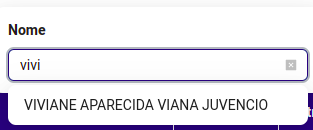

---
tags:
  - front-end
  - Tecnologia
---
Debounce é uma forma de retardar uma Request para evitar Request desnecessárias para a API, a Request só é realizada depois de um tempo determinado. O objetivo é melhorar a performance e a experiência do usuário, evitando o envio de múltiplas requisições à API enquanto o usuário ainda está digitando. Ele só dispara a busca depois de um tempo de inatividade Precisei dessa abordagem para evitar um bug no [Next.js](Next.js.md) e no [React.js](React.js.md) quando tentei fazer uma Request para cada mudança de estado em uma variável. Basicamente, uma Request era feita dentro do `onChange`

exemplo:

```tsx
<AutoComplete
  searchValue={nameEmployee}
  getPopupContainer={(triggerNode) => triggerNode.parentNode}
  style={{ width: 300 }}
  placeholder="Digite o nome"
  options={options}
  onSelect={handleSelect}
  onSearch={handleChange}
  value={nameEmployee}
  allowClear={{ clearIcon: <CloseSquareFilled /> }}
  onClear={handleClear}
/>;

```

O comportamento desse componente é: buscar os resultados que combinam com o valor digitado, da seguinte forma:


```tsx
useEffect(() => {
  if (nameEmployee && nameEmployee.length >= 2) {
    getTransactionSearchEmployee({
      shopIds: convenio.id,
      name: nameEmployee,
    })
      .then((response) => {
        const newOptions = response
          .filter((employee) =>
            employee.name.toLowerCase().includes(nameEmployee.toLowerCase())
          )
          .map((employee) => ({
            value: employee.name,
            label: employee.name,
          }));

        setOptions(newOptions);
      })
      .catch((error: AxiosError) => {
        console.error("Erro ao buscar nomes:", error);
      });
  } else {
    setOptions([]);
  }
}, [nameEmployee]);

const handleChange = (value: string) => {
  setNameEmployee(value);
  if (!value || value.length < 2) {
    setOptions([]);
    props.setfilters({
      ...props.filters,
      name: undefined,
      cpfCnpj: undefined,
    });
  }
};
```

Todas as vezes que o valor do `nameEmployee` mudar e for maior ou igual a 2, o `front` pede ao `back` os registros que combinam com o valor digitado. Porém, um problema estava acontecendo, ao digitar várias vezes, múltiplas requisições estavam sendo feitas, e quando as respostam chegava, o componente era montado com valores que não correspondiam com o input digitado.


Mas ao esperar o usuário terminar de digitar e só então fazer a requisição, resolveu o problema. Da seguinte forma:

```tsx
useEffect(() => {
  const handler = setTimeout(() => {
    if (nameEmployee && nameEmployee.length >= 2) {
      getTransactionSearchEmployee({
        shopIds: convenio.id,
        name: nameEmployee,
      })
        .then((response) => {
          const newOptions = response
            .filter((employee) =>
              employee.name.toLowerCase().includes(nameEmployee.toLowerCase())
            )
            .map((employee) => ({
              value: employee.name,
              label: employee.name,
            }));
          setOptions(newOptions);
        })
        .catch((error: AxiosError) => {
          console.error("Erro ao buscar nomes:", error);
        });
    } else {
      setOptions([]);
    }
  }, 1000);

  return () => {
    clearTimeout(handler);
  };
}, [nameEmployee]);
```

E este é o resultado:



***Don't worry and be happy!!! Drink water <3***